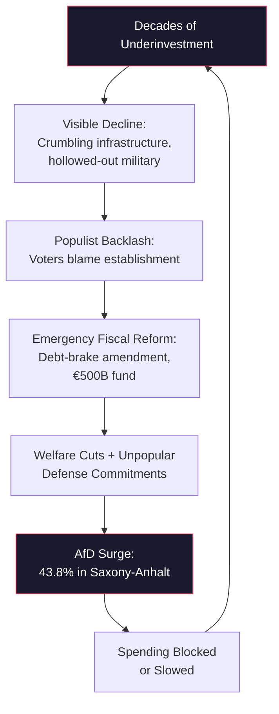

On September 6, the Alternative for Germany won [43.8 percent of the vote](https://www.npr.org/2026/09/06/nx-s1-5955677/german-afd-far-right) in Saxony-Anhalt — the strongest result for a far-right party in any German state election since 1945. Eight days earlier, the Finance Ministry published its first monitoring report on the €500 billion infrastructure fund created by last year's historic debt-brake reform: [28 percent of the 2026 allocation had been deployed](https://www.bloomberg.com/news/articles/2026-06-01/germany-s-500-billion-infrastructure-fund-has-sluggish-start). Roughly €11 billion of a planned €40 billion. The money meant to rebuild Germany is barely moving. The party that wants to stop it is accelerating.

These are not two stories. They are one structural paradox — a doom loop in which the spending designed to address German decline fuels the political backlash that threatens to kill the spending.

*[View original article on Fortune →](https://fortune.com/2026/09/07/germany-firewall-afd-saxony-anhalt-far-right/)*

## The Constitutional Gamble That Backfired

In March 2025, the outgoing Bundestag did something Germany had avoided for seventy years: it [amended the constitutional debt brake](https://www.bruegel.org/newsletter/what-does-german-debt-brake-reform-mean-europe) to exempt defense spending above one percent of GDP and created a €500 billion off-budget fund for infrastructure, energy, and digital investment. The vote was rushed through before the new parliament convened — a procedural choice that haunts Chancellor Friedrich Merz to this day.

The logic was sound on paper. Germany had underinvested for two decades. Bridges were collapsing. The Bundeswehr was borrowing equipment for NATO exercises. Russia's invasion of Ukraine had exposed the hollowness of European defense. Something had to give, and the debt brake — enshrined in the Basic Law since 2009 — was the thing.

But the politics were toxic. The [Responsible Statecraft analysis](https://responsiblestatecraft.org/germany-defense-increase/) of the Ebert Foundation's Security Radar captures the fracture precisely: 54 percent of Germans support increasing defense spending, but 53 percent favor a negotiated settlement in Ukraine "even if Ukraine has to sacrifice territory." Only 11 percent support deploying German troops. The public wanted a stronger Germany, not a Germany that writes blank checks for someone else's war. The debt-brake reform delivered both at once.

<Callout type="info">
The numbers that define the paradox: Germany's defense budget will climb from €95.1 billion (2025) to €161.8 billion by 2029 — making it Europe's largest defense spender, overtaking the UK. The €500 billion infrastructure fund adds €58.9 billion in borrowing for 2026 alone. Combined, this is the largest fiscal expansion in postwar German history.
</Callout>

The AfD was the only major party that opposed both moves. Alice Weidel called the defense spending plan a ["Titanic-level error."](https://www.youtube.com/watch?v=PK7dWCWg-uM) The CDU's own fiscal-conservative base — the voters who elected Merz precisely because he promised fiscal discipline — watched him abandon the debt brake within weeks of taking office. The defections were immediate and measurable.

<iframe width="100%" height="400" src="https://www.youtube.com/embed/jOSdKN8I0go" title="Official results: Far-right party wins Saxony-Anhalt state elections | DW News" frameBorder="0" allow="accelerometer; autoplay; clipboard-write; encrypted-media; gyroscope; picture-in-picture" allowFullScreen style={{borderRadius: '12px', marginTop: '1rem', marginBottom: '2rem'}}></iframe>

## Three Lessons from the Crack

The conventional narrative treats the AfD's rise as a story about migration, eastern German identity, or social media radicalization. Those are factors. But the structural story is about fiscal politics and democratic legitimacy — and it carries three lessons that extend well beyond Germany.

### Lesson 1: The Firewall Is Functionally Dead

Germany's *Brandmauer* — the postwar consensus that mainstream parties will never cooperate with the far right — lasted as formal doctrine for exactly as long as it was politically costless to maintain. It is now [functionally dead](https://foreignpolicy.com/2026/08/24/germany-afd-far-right-elections-saxony-anhalt-firewall/).

*[View discussion on Hacker News →](https://news.ycombinator.com/item?id=49602728)*

The evidence is procedural, not rhetorical. In January 2025, CDU parliamentarians [accepted AfD votes on a migration motion](https://moderndiplomacy.eu/2026/09/14/germany-afd-firewall-saxony-anhalt/) — then claimed the acceptance "doesn't count" because the follow-up bill failed. In September 2026, CDU parliamentarians passed a tax reduction with AfD votes, sending tremors across the political landscape. And in Saxony-Anhalt, BSW leader Amira Mohamed Ali — holding the balance of power with 5.3 percent — proposed a ["nonpartisan premier"](https://fortune.com/2026/09/07/germany-firewall-afd-saxony-anhalt-far-right/) who would govern using AfD votes in the chamber.

As the [Modern Diplomacy analysis](https://moderndiplomacy.eu/2026/09/14/germany-afd-firewall-saxony-anhalt/) published today puts it: "The taboo survives as language while the workarounds do the governing." An anti-AfD coalition in Saxony-Anhalt would require five parties — CDU, SPD, Greens, Left, and BSW — a formation so ideologically incoherent it would collapse under its own contradictions within months. The base case (55 percent probability by the author's estimate) is that such a coalition forms anyway, but struggles to govern effectively, continuing the exact trajectory that took the AfD from 20 percent to 43.8 percent in five years.

### Lesson 2: The 500 Billion Is Both Medicine and Poison

The infrastructure fund was designed to do two things: rebuild Germany's physical plant and demonstrate that the state can still deliver. It is failing at both, and the failure is feeding the AfD's narrative that the establishment is incompetent.

Through April 2026, the fund had deployed roughly €11 billion of its €40 billion annual allocation — a 28 percent burn rate that suggests deep institutional dysfunction. The problems are not financial (the money exists) but bureaucratic: planning approvals that take years, federal-state coordination failures, contractor shortages in eastern Germany where the need is greatest.

*[View original on Substack →](https://defencefinancemonitor.substack.com/p/germanys-500-billion-defence-fund)*

Meanwhile, [research from Social Europe](https://www.socialeurope.eu/targeted-infrastructure-spending-slows-afd-gains-in-germanys-industrial-heartlands) quantifies the political stakes with precision: a one-standard-deviation rise in infrastructure funding corresponds to a 0.23 percentage-point reduction in AfD vote growth. An additional €100 per resident in infrastructure spending correlates with roughly one percentage point lower AfD growth in high-exposure counties. The spending works — when it arrives. In Saxony-Anhalt, it has not arrived fast enough.

<Callout type="tip">
The infrastructure-AfD correlation: €100 per resident in targeted infrastructure spending reduces AfD vote growth by approximately 1 percentage point in transition-pressured regions. The formula is known. The execution is failing.
</Callout>

The defense side of the equation carries its own political toxin. Germany is paying for rearmament [through legislated pension and health-insurance cuts](https://moderndiplomacy.eu/2026/09/05/europe-rearmament-welfare-state-tradeoff/) that have pushed the AfD nine points clear of the governing CDU in some polls. The party's position is structurally advantageous: it opposes the spending, benefits from the discontent the spending creates, and would face no accountability for the consequences of canceling it.

<iframe width="100%" height="400" src="https://www.youtube.com/embed/cUW7iECbWCk" title="This Is How ALICE WEIDEL's AfD Would Transform GERMANY | VisualPolitik EN" frameBorder="0" allow="accelerometer; autoplay; clipboard-write; encrypted-media; gyroscope; picture-in-picture" allowFullScreen style={{borderRadius: '12px', marginTop: '1rem', marginBottom: '2rem'}}></iframe>

### Lesson 3: Germany's Internal Crisis IS the European Security Crisis

This is the lesson that European capitals have not yet absorbed. Germany was supposed to become the [strongest conventional military power in Europe by 2029](https://breakingdefense.com/2026/03/new-status-quo-germany-reaches-for-european-conventional-military-dominance/) — a €377 billion acquisition program covering F-35s, IRIS-T air defense, Tomahawk cruise missiles, and the Taurus Neo. The [SIPRI data confirms](https://www.sipri.org/media/press-release/2026/global-military-spending-rise-continues-european-and-asian-expenditures-surge) Germany has already overtaken the UK as Europe's largest defense spender, with a 24 percent year-on-year increase to $114 billion in 2025.

*[View SIPRI press release →](https://www.sipri.org/media/press-release/2026/global-military-spending-rise-continues-european-and-asian-expenditures-surge)*

But that trajectory depends entirely on sustained political will — and the AfD is the largest opposition party in the Bundestag. If it gains enough Bundesrat influence through state election victories, it can [actively block federal fiscal reforms](https://www.veritaseuropaea.eu/blog/2026/05/25/the-afd-at-the-gate-what-happens-to-germanys-economy-if-the-firewall-falls/) and infrastructure spending that economists identify as essential for growth. The party's fiscal platform — restore the strict debt brake, slash taxes, maintain social spending — is mathematically impossible, but political platforms do not need to be mathematically possible to win elections.

The downstream effects for Europe are severe. [Bruegel estimates](https://www.bruegel.org/newsletter/what-does-german-debt-brake-reform-mean-europe) the debt-brake reform could lift EU GDP by 0.75 percent by 2035, with roughly one-third coming from spillovers. If Germany's spending stalls, so does the growth impulse for the entire eurozone. The [Atlantic Council analysis](https://www.atlanticcouncil.org/blogs/new-atlanticist/germany-wants-to-double-its-defense-spending-where-should-the-money-go/) of where the defense money should go becomes academic if the money stops flowing.

And at the strategic level, Germany is already exploring [nuclear cooperation with France and the UK](https://breakingdefense.com/2026/03/new-status-quo-germany-reaches-for-european-conventional-military-dominance/) to compensate for diminished US credibility — discussions about a "forward deterrence" group potentially hosting French nuclear assets on German soil. These conversations assume a Germany that is politically stable enough to sustain a decades-long defense commitment. That assumption is no longer safe.

## The Doom Loop, Diagrammed

The structural trap is circular and self-reinforcing:

1. **Underinvestment** creates visible decline — crumbling infrastructure, hollowed-out military, eastern German economic stagnation.
2. **Decline drives populist support** as voters blame the establishment for decades of neglect.
3. **Emergency fiscal reform** (debt-brake amendment, €500B fund) addresses the underinvestment but violates fiscal-conservative principles and funds unpopular defense commitments.
4. **Backlash strengthens the AfD**, which opposes the spending and benefits from the welfare cuts needed to finance it.
5. **AfD influence blocks or slows spending**, returning to Step 1.

Each rotation through this loop narrows the democratic space available for governance. The CDU cannot abandon the spending without losing NATO credibility. It cannot sustain the spending without losing voters to the AfD. And it cannot cooperate with the AfD without destroying the postwar consensus that defines Germany's democratic identity.

## What the Community Is Saying

The Hacker News discussion on ["Why the AfD Wins"](https://news.ycombinator.com/item?id=49602728) captured a thread that rarely surfaces in institutional analysis: the top-voted comment argued that "the main reason AfD won is the incompetence and arrogance of all other parties." This is not the analytical framing of Chatham House or CSIS — but it is precisely the sentiment that drives elections.

*[View discussion on Hacker News →](https://news.ycombinator.com/item?id=49610890)*

The [parallel HN thread](https://news.ycombinator.com/item?id=49610890) on "The far right's win sending a chill through Europe's establishment" drew an international response, with commenters drawing parallels to Marine Le Pen's trajectory in France, the Sweden Democrats' coalition normalization, and the question of whether Germany's "exceptionalism" in maintaining a far-right cordon sanitaire was always more myth than mechanism.

*[View original on Substack →](https://hdepaola.substack.com/p/germanys-far-right-firewall-cracks)*

The Substack analysis ecosystem has been particularly sharp. The [Defence Finance Monitor](https://defencefinancemonitor.substack.com/p/germanys-500-billion-defence-fund) dissected the €500B fund's structure and deployment challenges, while a [geopolitics newsletter analysis](https://hdepaola.substack.com/p/germanys-far-right-firewall-cracks) of the firewall's erosion traced the procedural workarounds that make the formal exclusion meaningless.

<Callout type="warning">
Contrarian Corner: The firewall was never as strong as its mythology suggested. The Weimar Republic had a similar cordon against extremist parties. It held until it didn't, and the transition was not gradual — it was a phase change. The current AfD trajectory (20% nationally, 43.8% regionally) is still below the threshold where phase changes become likely. But the mechanism that prevented Germany from reaching that threshold — the willingness of mainstream parties to form unwieldy coalitions rather than cooperate with the far right — is degrading with each election cycle. The question is not whether the firewall will fall. It is whether it matters that it falls, because by the time it does, the workarounds will have already accomplished what the firewall was supposed to prevent.
</Callout>

## What Happens Next

The [CSIS analysis](https://www.csis.org/analysis/far-right-breakthrough-germanys-afd-brink-state-level-governance) frames the immediate calendar: Germany faces four more state elections before the end of 2026. In each, the AfD is polling competitively. If the Saxony-Anhalt pattern repeats — the firewall formally holds, but coalition arithmetic becomes increasingly impossible — the federal implications compound. A Bundesrat in which AfD-influenced states hold blocking minorities could stall infrastructure appropriations, defense procurement timelines, and EU fiscal coordination.

*[View analysis on Modern Diplomacy →](https://moderndiplomacy.eu/2026/09/14/germany-afd-firewall-saxony-anhalt/)*

<iframe width="100%" height="400" src="https://www.youtube.com/embed/oOk01r2eoc0" title="The far right's rise: Is Germany at a breaking point? | To the Point" frameBorder="0" allow="accelerometer; autoplay; clipboard-write; encrypted-media; gyroscope; picture-in-picture" allowFullScreen style={{borderRadius: '12px', marginTop: '1rem', marginBottom: '2rem'}}></iframe>

Three scenarios, roughly weighted:

**Scenario 1 — Muddle Through (50%):** Unwieldy coalitions hold in new states. The €500B fund slowly deploys. Defense spending reaches 2.5 percent of GDP by 2028 but misses the 3.5 percent NATO target. The AfD plateaus nationally around 22-25 percent — enough to disrupt, not enough to govern. Europe adjusts to a slower German rearmament schedule.

**Scenario 2 — Acceleration (30%):** The AfD participates in a state government, either through formal coalition or through the BSW "nonpartisan premier" model. Markets react (German Bund spreads widen), the EU fiscal coordination mechanism comes under strain, and the defense timeline slips further. NATO contingency planning shifts from "Germany leads European defense" to "Germany is a variable."

**Scenario 3 — Rupture (20%):** AfD gains sufficient Bundesrat influence to block federal fiscal reforms. The €500B fund is restructured or scaled back. Germany's defense trajectory flattens. France and Poland move to lead European defense independently, and the post-2022 rearmament consensus fractures along national lines. This is the scenario in which [Bruegel's 0.75 percent EU GDP uplift](https://www.bruegel.org/newsletter/what-does-german-debt-brake-reform-mean-europe) disappears — along with the strategic assumption that Germany will anchor European conventional deterrence for the next generation.

The through-line connects to our earlier analysis of the [sovereign-capacity trade shaping 2026](/blog/sovereign-compute-radical-optionality-eu-army-through-line-2026): states acquiring their own defense and infrastructure capacity because depending on external actors is no longer tenable. Germany is the critical test case. If the state that is most capable of executing this trade — the largest economy in Europe, the fourth-largest defense spender globally — cannot sustain the political consensus to do so, the entire European project of strategic autonomy faces its most serious challenge since the euro crisis.

The [Ankara NATO summit](/blog/ankara-nato-summit-alliance-fracture) exposed NATO's political conditioning. The [100-year drone pact](/blog/nato-100-year-drone-pact) showed where the alliance's industrial base is heading. Germany's €500B was supposed to be the bridge between political intent and military capability. Instead, it may become the monument to a consensus that cracked before the concrete set.

---

*The Arc of Power tracks the structural forces reshaping global order. Follow us for analysis that goes beyond the news cycle.*
